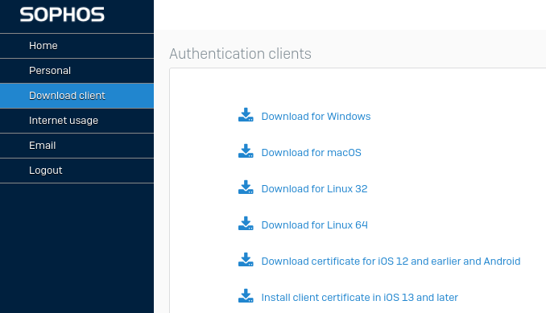

# Linux Sophos Client Installation Guide [VITAP]

This is brief installation guide to anyone who's having difficulties setting up the Sophos Client Authentication Agent on Linux for the VIT-AP campus

**Note:** _Make sure you're logged in to the VIT-AP Hostel Network before beginning the installation_

## Download & Extract

Start with downloading the Linux 64/32 client from [here](https://hfw.vitap.ac.in:445/)



```
Unpack all files into your HOME directory (tar -xzvf <FILENAME>).
You should have the following files after extracting:

<HOME>/.caa/
            ca-cert.pem
            caa.conf
            README
       bin/
            caa
```

The above step can be done either via the Terminal or with the GUI

#### via Terminal:

```
tar -xzvf caa_x64.tar.gz -C ~
```

#### via GUI:

Right-click and select extract after moving the .tar.gz file to the HOME directory [*the HOME directory is the one that contains your Desktop, Documents, Downloads etc*]

## Move the executable

This step is going to place the executable file "caa" in a location of your choice on your system. The executable is currently located in the "bin" directory that was extracted. You can move it to any directory that's in your system's PATH

I'm moving the file to:

- ~/.local/bin

**NOTE** _: The following steps assume you have done the same_

You can also choose to move it to some other location such as:

- /usr/local/bin (system-wide, requires admin privileges)
- ~/bin (user's personal bin directory)

```
mv ~/bin/caa ~/.local/bin/
```

## Calling from within ~/.bash_profile or .profile

This step ensures that your shell can call and execute the "caa" command from anywhere

_NOTE_ _: In case you have moved it to location that is already in your PATH (usr/local/bin), you can skip this step_

If you have moved it to a custom directory then you will have to add that to directory to your PATH

- Open ~/.bash_profile or ~/.profile via any text-editor of your choice, this can be done by:

```
nano ~/.profile

OR (Depending on your system, if your file looks empty its not the right one)

nano ~/.bash_profile
```

- Add the following line to the end of the file:

```
export PATH="$HOME/.local/bin:$PATH"
```

- After completing these steps, you'll need to either restart your terminal or run:

```
source ~/.bash_profile

OR

source ~/.profile
```

- Now open the caa.conf file in the .caa folder, located in your HOME directory

```
Copernicus host: 1.2.3.4
Username: {Enter your username here}
Password: {Enter your password here}
```

Save the file after entering your credentials

- You should now be able to run this command from your terminal now:

```
caa
```

Your output should look like this:

```
caa started in foreground mode.
Connecting to host 1.2.3.4 ...
Connected with ECDHE-RSA-AES256-GCM-SHA384 encryption.
Client type sent: Linux
Login was accepted.
```

## Run on startup

#### On Debian based systems:

Open Startup Applications and add the caa command

<!-- #### Using systemd

Create a new service file:
Use a text editor to create a new file in the /etc/systemd/system/ directory:

```
sudo nano /etc/systemd/system/caa.service
```
 -->
